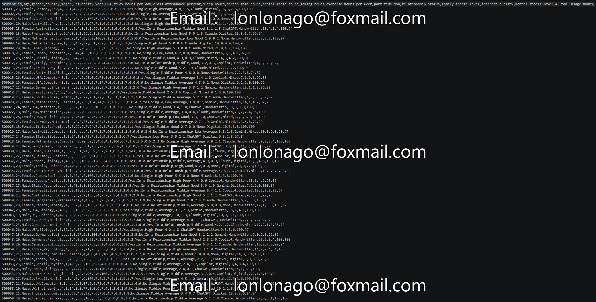

## Body

大学生表现与学习习惯 2026

What factors actually improve student performance?

The dataset contains 10,000 college students from various countries, including: Student ID, Age, Gender, Nationality, Major, University Year, GPA, Daily Study Hours, Attendance Rate in Class, Sleep Time, Screen Time, Social Media Use Time, Gaming Time, Weekly Exercise Duration, Part-time Job Status, Romantic Relationship Status, Family Income Level, Network Quality, Mental Pressure Level, AI Tools Used Time, Favorite AI Tool, Note Taking Method, Preparation Days, Daily Coffee Consumption, Extracurricular Activity Time per Week, Final Exam Score, Homework Score.

The goal is to help students, researchers, and machine learning practitioners understand how lifestyle and habits affect academic success.

The dataset has been fully cleaned and there are no missing values.

Practical uses of the dataset include:

- Regression: Predicting GPA or final exam scores
- Classification: Predicting passing/failing or stress levels
- Correlation analysis
- Data visualization and dashboards
- Feature importance analysis
- Student performance prediction
- Beginner and intermediate machine learning projects

Dataset size:
Number of rows: 10,000 people
Columns: 27
Missing values: 0
File type: CSV

Electronic virtual products sold without returns.

## Images

Here is a pay link on Stripe ( https://buy.stripe.com/3cs8yP7sY87d0vu9AB ). Please contact me lonlonago@foxmail.com after funding $89, and I will send you a complete data files , thank you!

